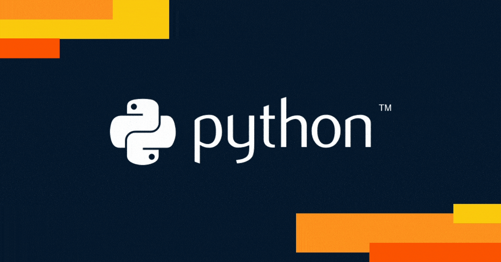

<div align="center">


<br/>


<br/><br/>

<a href="mailto:ghulammurtazapixel6@gmail.com">

</a>

<a href="https://www.linkedin.com/in/ghulam-murtaza-640478250/">

</a>

<a href="https://github.com/Murtazagonhit10">

</a>


</div>

---

# 01. ABOUT ME

<table>
<tr>
<td width="58%">

```python
class GhulamMurtaza:

    def __init__(self):
        self.location = "Lahore, Pakistan"
        self.education = "BS Data Science @ FAST-NUCES"
        self.cgpa = "3.56 / 4.0"

        self.interests = [
            "Deep Learning",
            "Agentic AI",
            "Computer Vision",
            "Full-Stack Development",
            "Game Development"
        ]

    def currently_working_on(self):
        return [
            "AI-powered applications",
            "Interactive ML systems",
            "Modern web experiences",
            "Computer vision projects"
        ]

    def quote(self):
        return "Building AI systems that don't just work, but make sense."
```

</td>

<td width="42%">


</td>
</tr>
</table>

---

# 02. TECH STACK

<div align="center">

### LANGUAGES

<p>


</p>

<br/>

### AI / MACHINE LEARNING

<p>


</p>

<br/>

### WEB / BACKEND

<p>


</p>

</div>

---

# 03. FEATURED PROJECTS

<div align="center">

<table>

<tr>
<td width="50%">

## ⚽ Maidan

Modern indoor sports facility booking platform designed for real-time venue discovery and reservations.

```yaml
APIs: 15+
Database Tables: 13
Authentication: JWT + bcrypt
Performance: Booking completion under 60 seconds
```

**Features**
- Venue filtering system
- Real-time booking slots
- Player dashboard & history
- Responsive UI
- Interactive 3D experience

**Tech**
`Next.js` `Three.js` `MS SQL Server` `JWT`

🔗 https://github.com/Murtazagonhit10/Maidan

</td>

<td width="50%">


</td>
</tr>

<tr>
<td width="50%">



</td>

<td width="50%">

## 🚦 Traffic Sign Recognition

CNN-powered traffic sign classifier trained on the GTSRB dataset.

```yaml
Accuracy: 95%+
Classes: 43
Model Type: CNN
Role: Solo
```

**Features**
- Image preprocessing pipeline
- Resizing & normalization
- Prediction visualization
- Model evaluation metrics

**Tech**
`TensorFlow` `Keras` `OpenCV` `Python`

🔗 https://github.com/Murtazagonhit10/Breaking_Signs

</td>
</tr>

<tr>
<td width="50%">

## 📊 Gradient Field Analyzer

Mathematical visualization system for gradient computation and critical point analysis.

```yaml
Functions: Multivariable
Visualizations: 3D surfaces + vector fields
ML Integration: Critical point classification
Role: Solo
```

**Features**
- Gradient computation
- Vector field rendering
- Surface visualization
- Scope-limited query handling

**Tech**
`Python` `NumPy` `Matplotlib`

🔗 https://github.com/Murtazagonhit10/MapTheMath

</td>

<td width="50%">


</td>
</tr>

<tr>
<td width="50%">


</td>

<td width="50%">

## 🏎️🐦 F1 Bird

Retro Flappy Bird-inspired arcade game built completely in x86 Assembly.

```yaml
Engine: Low-level Assembly
Gameplay: Real-time keyboard interaction
Modes: Multiple gameplay modes
Role: Solo
```

**Features**
- Dynamic obstacle generation
- Keyboard controls
- Pause & quit handling
- Retro arcade mechanics
- Efficient memory handling

**Tech**
`x86 Assembly` `DOS Interrupts`

🔗 https://github.com/Murtazagonhit10/F1Bird

</td>
</tr>

<tr>
<td width="50%">

## 👻🟡 PookieMan

Pac-Man-inspired arcade game with ghost AI and custom gameplay mechanics.

```yaml
Gameplay: Real-time rendering
AI: Multiple enemy behaviors
Architecture: OOP
Role: Team Project
```

**Features**
- Ghost AI system
- Collision detection
- Collectibles & scoring
- Custom maps
- Smooth animations

**Tech**
`C++` `SFML`

🔗 https://github.com/Murtazagonhit10/PookieMan

</td>

<td width="50%">


</td>
</tr>

</table>

</div>

---

# 04. EXPERIENCE SNAPSHOT

<div align="center">

```text
🎓 BS Data Science @ FAST-NUCES
📈 CGPA: 3.56 / 4.0
🏅 Dean's List — Fall 2024, Spring 2025, Fall 2025

🏆 ACM Certificate of Appreciation
🏆 Cipher Craft '24
🏆 Decthon
🏆 Microsoft Office Specialist
🏆 Atomcamp Agentic AI Hackathon — EchoMind AI
🏆 BNU BTech Fest — Flood Predictor
```

</div>

---

# 05. DEVELOPMENT ACTIVITY

<div align="center">


<br/><br/>

</div>

---

# 06. GITHUB ANALYTICS

<div align="center">


</div>

---

<div align="center">


<br/>

</div>
